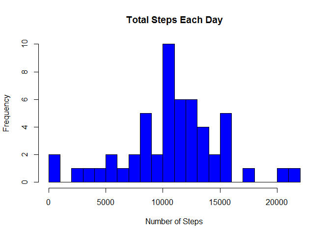
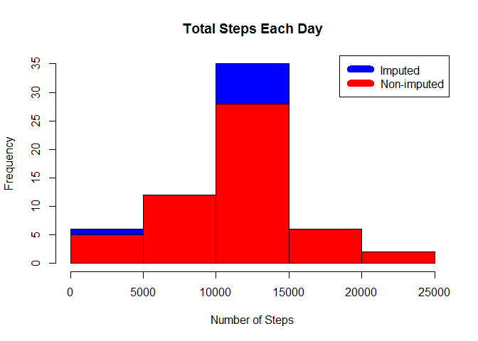
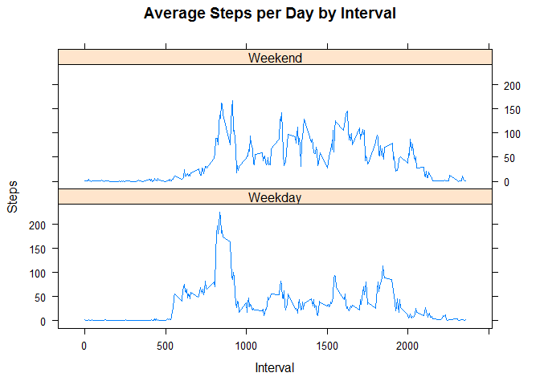

# Reproducible Research: Peer Assessment 1
Mayank Anil Pohre  

# About 
This is the first project for the Reproducible Research course in Coursera's Data Science specialization Course The purpose of the project is to answer a series of questions using data collected from a FitBit.

# Synopsis
***
The purpose of this project is to practice:

+ loading and preprocessing data
+ imputing missing values
+ interpreting data to answer research questions

# Data
***
The data used for this research can be downloaded here [Activity monitoring data ](https://d396qusza40orc.cloudfront.net/repdata%2Fdata%2Factivity.zip)  

The variables included in this dataset are:

+ **steps**: Number of steps taking in a 5-minute interval (missing values are coded as NA)
+ **date**: The date on which the measurement was taken in YYYY-MM-DD format
+ **interval**: Identifier for the 5-minute interval in which measurement was taken

# Loading and preprocessing the data
***
Download, unzip and load data into data frame


```r
if(!file.exists("getdata-projectfiles-UCI HAR Dataset.zip")) {
        temp <- tempfile()
        download.file("http://d396qusza40orc.cloudfront.net/repdata%2Fdata%2Factivity.zip",temp)
        unzip(temp)
        unlink(temp)
}

data <- read.csv("activity.csv")

data$date <- as.Date(data$date)
```

# Total number of steps taken per day
***

```r
steps_by_day <- aggregate(steps ~ date, data, sum)
hist(steps_by_day$steps, main = paste("Total Steps Each Day"), col="blue", xlab="Number of Steps", breaks = 20)
```

<!-- -->

```r
rmean <- mean(steps_by_day$steps)
rmedian <- median(steps_by_day$steps)
paste("The mean =",rmean,"& the Median =",rmedian)
```

```
## [1] "The mean = 10766.1886792453 & the Median = 10765"
```
# Average daily activity pattern
***
+ Calculate average steps for each interval for all days.
+ Plot the Average Number Steps per Day by Interval.
+ Find interval with most average steps.


```r
steps_by_interval <- aggregate(steps ~ interval, data, mean)

plot(steps_by_interval$interval,steps_by_interval$steps, type="l", xlab="Interval", ylab="Number of Steps",main="Average Number of Steps per Day by Interval")
```

<!-- -->

```r
max_interval <- steps_by_interval[which.max(steps_by_interval$steps),1]
paste("The 5-minute interval, that contains the maximum number of steps is =",max_interval)
```

```
## [1] "The 5-minute interval, that contains the maximum number of steps is = 835"
```

# Impute missing values. Compare imputed to non-imputed data.
***
Missing data had to be imputed. Only a simple imputation approach is required for this assignment. Missing values were imputed by inserting the average for each interval. Thus, if interval 10 was missing on 10-02-2012, the average for that interval for all days (0.1320755), replaced the NA.


```r
incomplete <- sum(!complete.cases(data))
imputed_data <- transform(data, steps = ifelse(is.na(data$steps), steps_by_interval$steps[match(data$interval, steps_by_interval$interval)], data$steps))
```
Zeroes were imputed for 10-01-2012 because it was the first day and would have been over 9,000 steps higher than the following day, which had only 126 steps. NAs then were assumed to be zeros to fit the rising trend of the data.


```r
imputed_data[as.character(imputed_data$date) == "2012-10-01", 1] <- 0
```
Recount total steps by day and create Histogram


```r
steps_by_day_i <- aggregate(steps ~ date, imputed_data, sum)
hist(steps_by_day_i$steps, main = paste("Total Steps Each Day"), col="blue", xlab="Number of Steps")

# Create Histogram to show difference. 
hist(steps_by_day$steps, main = paste("Total Steps Each Day"), col="red", xlab="Number of Steps", add=T)
legend("topright", c("Imputed", "Non-imputed"), col=c("blue", "red"), lwd=10)
```

<!-- -->

New mean and median for imputed data

```r
rmean_i <- mean(steps_by_day_i$steps)
rmedian_i <- median(steps_by_day_i$steps)
```
Difference between imputed and non-imputed data.

```r
mean_diff <- rmean_i - rmean
med_diff <- rmedian_i - rmedian
```
Total difference

```r
total_diff <- sum(steps_by_day_i$steps) - sum(steps_by_day$steps)
paste("The imputed data mean is ",rmean_i)
```

```
## [1] "The imputed data mean is  10589.6937828642"
```

```r
paste("The imputed data median is ", rmedian_i)
```

```
## [1] "The imputed data median is  10766.1886792453"
```

```r
paste("The difference between the non-imputed mean and imputed mean is ",mean_diff)
```

```
## [1] "The difference between the non-imputed mean and imputed mean is  -176.494896381069"
```

```r
paste("The difference between the non-imputed median and imputed median is ", med_diff)
```

```
## [1] "The difference between the non-imputed median and imputed median is  1.1886792452824"
```

```r
paste("The difference between total number of steps between imputed and non-imputed data is ",total_diff," Thus, there were",total_diff, "more steps in the imputed data.")
```

```
## [1] "The difference between total number of steps between imputed and non-imputed data is  75363.320754717  Thus, there were 75363.320754717 more steps in the imputed data."
```

# Are there differences in activity patterns between weekdays and weekends?
created a plot to compare and contrast number of steps between the week and weekend. There is a higher peak earlier on weekdays, and more overall activity on weekends.


```r
weekdays <- c("Monday", "Tuesday", "Wednesday", "Thursday", 
              "Friday")
imputed_data$dow = as.factor(ifelse(is.element(weekdays(as.Date(imputed_data$date)),weekdays), "Weekday", "Weekend"))

steps_by_interval_i <- aggregate(steps ~ interval + dow, imputed_data, mean)

library(lattice)

xyplot(steps_by_interval_i$steps ~ steps_by_interval_i$interval|steps_by_interval_i$dow, main="Average Steps per Day by Interval",xlab="Interval", ylab="Steps",layout=c(1,2), type="l")
```

<!-- -->

